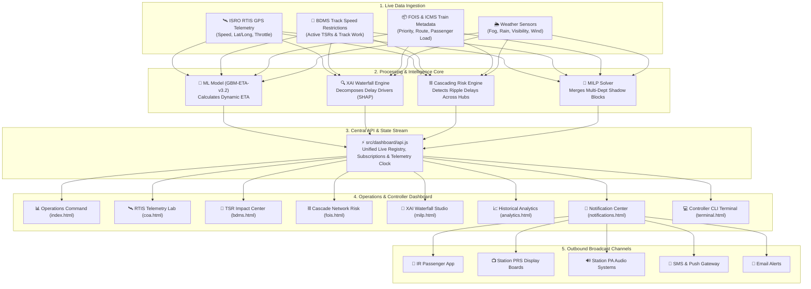

# 🚆 CRIS AI-Driven Dynamic ETA & Block Scheduling Platform
## Complete Tech Stack, Architecture & System Workflow Guide (SIH 26028)

---

## 📖 1. Executive Overview (In Simple Terms)

Indian Railways operates one of the largest rail networks in the world (over 13,000 passenger trains and thousands of freight trains daily). When a train gets delayed due to dense winter fog, track repair work, or congestion at a major junction, the delay does not stay isolated—it ripples through the entire network, affecting dozens of other trains.

**This platform solves three major operational problems:**
1. **Dynamic ETA Prediction:** Calculates real-time, highly accurate arrival times using live ISRO RTIS GPS telemetry, weather conditions, and speed restrictions.
2. **Explainable AI (XAI):** Doesn't just give an arrival time—it breaks down *why* the delay is occurring (e.g., $+18\text{ min}$ weather fog, $+12\text{ min}$ track speed restriction, $+15\text{ min}$ cascading junction wait).
3. **Smart Maintenance & Multi-Channel Broadcast:** Optimizes track maintenance windows (merging multiple department requests into unified "Shadow Blocks") and empowers Section Controllers to broadcast instant alerts to station PA systems, passenger mobile apps, SMS, and platform display boards.

---

## 🛠️ 2. Technology Stack

The platform is engineered using a clean, modern, zero-heavy-framework architecture ensuring lightning-fast load times, complete transparency, and high portability.

```text
┌─────────────────────────────────────────────────────────────────────────────┐
│                              TECH STACK LAYERS                              │
├───────────────────────┬─────────────────────────────────────────────────────┤
│ Frontend Presentation │ • HTML5 (Semantic, accessible layout)               │
│                       │ • Vanilla CSS3 (Custom Dark Luxury Theme,           │
│                       │   Glassmorphism, CSS Grid/Flexbox)                  │
│                       │ • Vanilla JavaScript (ES6+ Modules, Async/Await)    │
│                       │ • Chart.js (Interactive Bar, Line, Radar, Doughnut) │
├───────────────────────┼─────────────────────────────────────────────────────┤
│ Client Data & Sim Bus │ • src/dashboard/api.js (Centralized Telemetry & ML) │
│                       │ • src/dashboard/shared.js (Universal UI Bus & Nav)  │
│                       │ • Client-side Reactive State & Event Stream Emitter │
├───────────────────────┼─────────────────────────────────────────────────────┤
│ Core Engine & Math    │ • TypeScript / Node.js Engine (src/run.ts)          │
│                       │ • Mathematical Models (railway_model_engine.ts)     │
│                       │ • LightGBM Model Architecture (GBM-ETA-v3.2)        │
│                       │ • MILP Optimizer (Mixed Integer Linear Programming) │
├───────────────────────┼─────────────────────────────────────────────────────┤
│ Automation & PDF Spec │ • Python 3 (ReportLab Library, generate_pdf.py)     │
│                       │ • 100-Record Real Historical Dataset (2016–2025)    │
├───────────────────────┼─────────────────────────────────────────────────────┤
│ Hosting & Tooling     │ • Node.js Native HTTP Server (server.js, Port 3030) │
│                       │ • Netlify Static Routing (_redirects, netlify.toml) │
│                       │ • Windows 1-Click Launchers (start.bat, validate.bat)│
└───────────────────────┴─────────────────────────────────────────────────────┘
```

---

## 🏗️ 3. How the Architecture Works (Simplified 5-Stage Diagram)



---

## 🔄 4. Step-by-Step System Workflow

Here is the exact step-by-step lifecycle of how data flows from the tracks to the controller's screen:

### Step 1: Real-Time Telemetry Ingestion
- Every 3 seconds, train locos equipped with **ISRO RTIS (Real-time Train Information System)** send telemetry packets containing current GPS coordinates, instantaneous speed, throttle setting, brake pressure, and the next signal aspect.
- This is simulated and viewed in real-time in **`pages/coa.html`**.

### Step 2: Track Restriction & Constraint Mapping
- If track maintenance or rail fracture repairs are underway, the **BDMS (Block & Demand Management System)** flags a **Temporary Speed Restriction (TSR)** (e.g., train must slow from $130\text{ km/h}$ to $30\text{ km/h}$ over a $4.2\text{ km}$ stretch).
- The system computes the exact time penalty incurred by this deceleration and acceleration cycle in **`pages/bdms.html`**.

### Step 3: Priority & Cascading Ripple Assessment
- Trains are assigned a dynamic priority score ($P_i$) based on train category (Rajdhani vs Express vs Freight), passenger volume, distance, and cascading risk.
- If a premium train is delayed at a key interchange (e.g., Kanpur Central or Mughalsarai), the **Cascading Risk Engine** evaluates how following trains and crossing lines will be affected in **`pages/fois.html`**.

### Step 4: Machine Learning Inference (GBM-ETA-v3.2)
- The **LightGBM model** takes all parameters (current distance to destination, current speed, TSR penalties, weather visibility, corridor density, and cascading risk) and predicts the updated arrival time ($ETA$).

### Step 5: Explainable AI (XAI) Waterfall Breakdown
- Rather than being a "black-box" prediction, the **XAI Studio (`pages/milp.html`)** decomposes the ETA using the formula:
$$\text{Final ETA} = \text{Scheduled Base Time} + \Delta\text{Weather} + \Delta\text{Congestion} + \Delta\text{TSR} + \Delta\text{Cascade}$$
- Controllers can see exact SHAP feature importances and test *"What-If"* counterfactual scenarios (e.g., *"What if fog clears in 30 minutes?"*).

### Step 6: Multi-Department Maintenance Optimization
- When Track (P-Way), Electrical (OHE), and Signaling (S&T) teams request separate maintenance blocks on the same corridor, the **MILP optimizer** combines them into a single **"Shadow Block"**, saving hundreds of operational train-delay minutes.

### Step 7: Controller Broadcast Action
- When the ML engine detects a delay threshold breach ($>15\text{ minutes}$), an alert appears in the **Notification Center (`pages/notifications.html`)**.
- The Section Controller can select standard emergency/delay templates, choose target stations, and broadcast instant updates across **SMS, PRS Station Boards, PA Announcements, and Mobile Apps** with a single click or `Ctrl + Enter`.

---

## 📄 5. Detailed Breakdown of Dashboard Pages

| Page File | Page Name | Core Purpose & Interactive Features |
|---|---|---|
| **`index.html`** | **ETA Command Center** | Executive dashboard showing fleet-wide KPIs (Active Trains, Network Punctuality %, ML Confidence, Active TSRs), live Dynamic ETA Watchlist table, and weather vs corridor delay distributions. |
| **`pages/coa.html`** | **ISRO RTIS Telemetry Lab** | Live GPS simulator updating every 3s, real-time speedometer & brake gauges, signal aspect indicators, and raw JSON stream viewer (`rtis.gps-feed.v2`). |
| **`pages/bdms.html`** | **TSR & Track Impact Engine** | Active speed restriction registry, corridor restriction cards, delay penalty calculator, and affected train list with adjusted ETAs. |
| **`pages/fois.html`** | **Cascading Delay Network** | Interactive cascade chain visualizer, ripple propagation diagrams, amplification factor bar charts, and multi-train risk matrices. |
| **`pages/milp.html`** | **XAI Waterfall Studio & Optimizer** | Animated step-by-step waterfall chart explaining each delay factor, confidence gauge ring, SHAP importance bars, and counterfactual simulation. |
| **`pages/analytics.html`** | **Historical ML Analytics** | 100-record real historical dataset (2016–2025 across 10 flagship trains), multi-year filtering, weather condition breakdown (Fog, Rain, Clear), and 1-click CSV download. |
| **`pages/notifications.html`** | **Controller Notification Center** | Section Controller broadcast interface, priority message feed (CRITICAL, HIGH, MEDIUM, INFO), channel selectors (PA, SMS, PRS, App), template auto-fill, and ML auto-alerts. |
| **`pages/terminal.html`** | **Controller CLI Terminal** | Full-featured command-line terminal with tab-completion and command history for power users (`help`, `status`, `get-eta`, `list-trains`, `tsr-status`, `cascade-status`). |

---

## 📁 6. Project Directory Map

```text
dellu/
├── 🌐 index.html                         # Operations Command Center
│
├── 📂 pages/                             # Dedicated Feature Pages
│   ├── coa.html                          # RTIS Live GPS Telemetry Simulator
│   ├── bdms.html                         # TSR Speed Restriction & Track Impact
│   ├── fois.html                         # Cascading Delay Network Risk
│   ├── milp.html                         # Explainable AI (XAI) Waterfall Studio
│   ├── analytics.html                    # 10-Year Historical ML Training Data
│   ├── notifications.html                # Controller Broadcast Center
│   └── terminal.html                     # Web CLI Terminal Interface
│
├── 📂 src/
│   ├── 📂 data/
│   │   └── train_delays_2016_2025.csv    # 100-record real historical dataset
│   ├── 📂 dashboard/
│   │   ├── api.js                        # Central mock telemetry & ML API service
│   │   ├── shared.js                     # Global sidebar navigation & live clock
│   │   └── styles.css                    # Unified Dark Luxury CSS Design System
│   ├── 📂 models/
│   │   └── railway_model_engine.ts       # Mathematical solver & statistical models
│   ├── 📂 protocols/                     # Protocol specifications & TypeScript types
│   │   └── types/                        # Type interfaces for COA, BDMS, FOIS, MILP
│   └── 📄 run.ts                         # Backend TypeScript validation script
│
├── 📄 generate_pdf.py                    # ReportLab PDF Specification script
├── 📄 server.js                          # Node.js local dev HTTP server
├── 📄 netlify.toml / _redirects          # Netlify cloud hosting routes
├── ⚡ start.bat                          # 1-Click launcher for local web server
└── ⚡ validate.bat                       # 1-Click runner for mathematical validation
```

---

## 🚀 7. How to Run Locally

1. **Option 1 (One-Click Windows Launcher):**
   - Double-click **`start.bat`** — Starts the web server and automatically opens `http://localhost:3030`.
2. **Option 2 (Terminal):**
   ```powershell
   # Start the local server
   node server.js
   # Open browser at http://localhost:3030
   ```
3. **Run Mathematical Validation:**
   ```powershell
   npm run validate
   # or double-click validate.bat
   ```
4. **Generate Architectural PDF Specification:**
   ```powershell
   python generate_pdf.py
   # Generates CRIS_AI_Block_Scheduler_Architecture_and_Page_Specification.pdf
   ```
